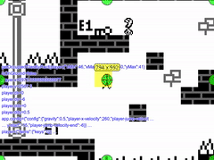

# Collision Handling for Kontra Sprites and Kontra TileEngine tiles

[](example.mkv)

**tl;dr** Jump to [Usage](#usage)

---

The `TileEngineHelper` wraps a `TileEngine` object.
It allows to render `Sprite` objects in the tile world
and is able to resolve collisions between `Sprite` objects and solid tiles.

The provided code is specialized for my own use case:

- Only one fixed layer is used for all tiles.
  The layer is currently named `ground`.
  This behavior can be changed easily

- Solid tiles have to be explicitly marked as solid, see [Usage](#usage)

- Sprite anchors are ignored.
  `TileEngineHelper` assumes that the top left corner is the origin

- Although a jump and run video is shown,
  the code is generic enough to be used for other genres,
  e.g. top-down RPGs, too

- `TileEngineHelper` adds the following properties to given `Sprite` objects

  - Required for resolving collisions

    - `Number sprite.previous.x`

    - `Number sprite.previous.y`

    - `Number sprite.previous.width`

    - `Number sprite.previous.height`

    - `bool sprite.previous.looksLeft`

  - For your convenience

    - `bool sprite.previous.isOnGround`

    - `bool sprite.previous.looksLeft`

    - `bool sprite.previous.looksRight`

    - `bool sprite.previous.movesLeft`

    - `bool sprite.previous.movesRight`

    - `bool sprite.previous.movesUp`

    - `bool sprite.previous.movesDown`

- Useful, but not here explained, methods:
  `getOccupiedTilesByRect`,
  `getOccupiedTilesByRectRectBoundingBox`,
  `getLeftMostTileInRange`,
  `getRightMostTileInRange`,
  `getTopMostTileInRange`,
  `getBottomMostTileInRange`,
  `isSolidTile`,
  `createDebugSprite`,

## File size

Bytes | File
---|---
12045 | TileEngineHelper.js
3548  | TileEngineHelper.min.js (Terser)
1269  | TileEngineHelper.min.js.zip

## How does it work?

A sprite occupies one or more tiles.
The `TileEngineHandler` searches for the first solid tile beginning from the occupied tiles of the old position.
If there is no solid tile between the old position and the new position,
then there is no collision on the current axis.
If a collision occurs,
the sprite will be placed on a valid position in front of the first solid tile.

**Example**

We are looking at a Sprite which is smaller than a tile
but is still occupying four tiles because
of its current position in the tile world.
The Sprite is marked with `P`.
Solid tiles are marked with `S`.

```
           S
PP         S
PP            S
```

The next position (without checking for collisions) is marked with `N`.
We are only considering the X axis because movement is done by axis.

```
           S
PP         S          NN
PP            S       NN
```

Now we are calling `TileEngineHelper.solveSpriteMovementX(sprite)`.
The effective position is marked with `D`.

```
           S
PP       DDS          NN
PP       DD   S       NN
```

Our resulting movement lookes like this:

```
           S
PP------>DDS
PP------>DD   S
```

## Usage

1. Wrap Kontra's `TileEngine` object

   ```javascript
   let teh = new TileEngineHelper(tileEngine);
   ```

1. Define solid tiles on the layer `ground`

   ```javascript
   teh.setTileCollisionHandler('ground', tileId, true);
   ```

1. Create a backup of the sprite's current position in `sprite.previous` by calling

   ```javascript
   teh.prepareMovement(sprite);
   ```

1. Move the sprite only on the X axis

1. Let `TileEngineHelper` resolve collisions with tiles

   ```javascript
   teh.solveSpriteMovementX(sprite);
   ```

   Calling this method will also update the following properties:
   
   - `bool sprite.looksLeft`

   - `bool sprite.looksRight`

   - `bool sprite.movesLeft`

   - `bool sprite.movesRight`

1. Move the sprite only on the Y axis.

   If you are making a Jump and Run game,
   you will have to apply gravity even when the player is already standing on the ground
   as `TileEngineHelper` will verify every step if the given sprite collides with the tile below.
   If it doesn't collide with a tile below,
   then the sprite is not standing on the ground!

1. Let `TileEngineHelper` resolve collisions with tiles

   ```javascript
   teh.solveSpriteMovementY(sprite);
   ```

   Calling this method will also update the following properties:
   
   - `bool sprite.isOnGround`

   - `bool sprite.movesUp`

   - `bool sprite.movesDown`

1. Render the sprite on the correct position in the tile world

   ```javascript
   teh.renderSpriteGlobally(sprite);
   ```

## Remarks

- This is an early prototype

- The API might change drastically or the project might get abandoned soon

- This is not one of my priority projects and will therefore not receive timely updates or fixes

- Feel free to share your ideas, improvements, other solutions or relevant projects.
